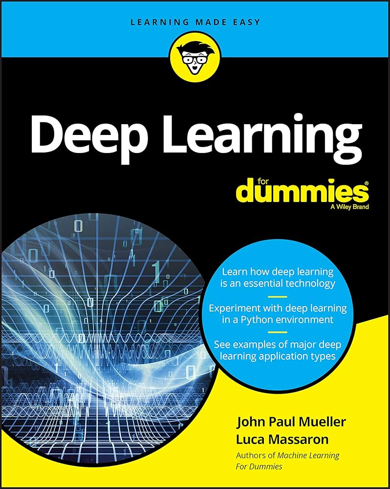

# Deep Learning For Dummies – Book Practice in Python 📘



This repository contains practical Python exercises and implementations from the book **"Deep Learning For Dummies"** by *John Paul Mueller* and *Luca Massaron*. The code is written and organized in a Jupyter Notebook for easy understanding and learning.

## 🔍 Overview

This notebook serves as a hands-on companion for readers of the book, helping reinforce key deep learning concepts through code examples and experiments.

## ✅ Features Covered

The notebook includes:

- ✅ **Introduction to Deep Learning**
  - Understanding what deep learning is and where it fits in the AI hierarchy.

- ✅ **Working with Neural Networks**
  - Structure of a neuron, layers, and activation functions.
  - Forward propagation and backpropagation.

- ✅ **Using TensorFlow and Keras**
  - Setting up your deep learning environment.
  - Building models using TensorFlow and Keras APIs.

- ✅ **Training Deep Learning Models**
  - Splitting datasets.
  - Compiling and fitting models.
  - Evaluating model accuracy and loss.

- ✅ **Convolutional Neural Networks (CNNs)**
  - Applying CNNs for image classification tasks.
  - Using layers like Conv2D, MaxPooling2D, and Flatten.

- ✅ **Overfitting and Regularization**
  - Techniques like dropout to prevent overfitting.
  - Understanding validation accuracy vs training accuracy.

- ✅ **Working with Real Data**
  - Loading and processing datasets.
  - Visualizing training history using matplotlib.

- ✅ **Working on Language Processing**
  - Basic NLP techniques.
  - Text vectorization and sequence modeling.

- ✅ **Building Generative Adversarial Networks**
  - Introduction to GANs.
  - Generator vs Discriminator architecture.

- ✅ **Playing with Deep Reinforcement Learning**
  - Understanding agents and environments.
  - Applying reinforcement learning to decision-making tasks.

> All exercises are implemented in a clean and beginner-friendly format to align with the book's style.

## 🛠️ Requirements

- Python 3.8+
- Jupyter Notebook
- TensorFlow
- Keras
- NumPy
- Matplotlib

Install dependencies using:

```bash
pip install -r requirements.txt
```

*(If a `requirements.txt` is not provided, you can manually install packages using `pip install tensorflow matplotlib numpy`)*

## 🧠 Ideal For:

- Beginners in deep learning and neural networks
- Readers of the **"Deep Learning For Dummies"** book
- Anyone looking for annotated, hands-on examples in Python

## 📬 Contact

Created by **Marius Iacob**  
📧 Email: mariusicob2347@gmail.com  
🌐 Portfolio: [https://marius-portofolio.fly.dev/](https://marius-portofolio.fly.dev/)

Feel free to reach out for collaboration or questions!

---

## ⭐️ Star this repository

If you find this project helpful, please consider starring ⭐ the repo to support the project and its future updates!
